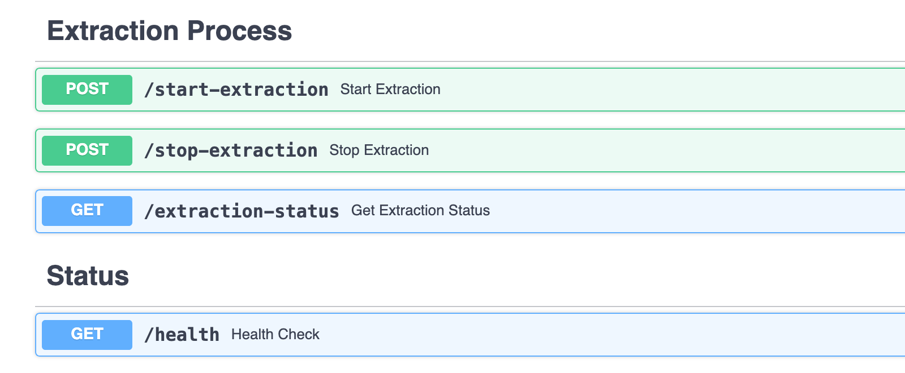

# Alert Term Extraction

<div id="top"></div>

[](https://github.com/CarlosUziel/alert-term-extraction/blob/main/LICENSE)
[](https://github.com/CarlosUziel/alert-term-extraction/stargazers)



A FastAPI app for extracting alert terms from unstructured alert texts. Designed for integration into larger systems or as a standalone tool for information extraction via a deployable microservice with Docker.

---

<details>
  <summary>📋 Table of Contents</summary>
  <ol>
    <li><a href="#-motivation">🧠 Motivation</a></li>
    <li><a href="#-features-summary">✨ Features Summary</a></li>
    <li><a href="#-solution-approach">🛠️ Solution Approach</a></li>
    <li>
      <a href="#-getting-started">🚀 Getting Started</a>
      <ul>
        <li><a href="#prerequisites">Prerequisites</a></li>
        <li><a href="#installation">Installation</a></li>
        <li><a href="#configuration">Configuration</a></li>
        <li><a href="#starting-the-fastapi-app">Starting the FastAPI App</a></li>
      </ul>
    </li>
    <li><a href="#-api-usage">📡 API Usage</a></li>
    <li><a href="#-architecture-overview">🏗️ Architecture Overview</a></li>
    <li><a href="#-file-structure">📂 File Structure</a></li>
    <li><a href="#-license">📄 License</a></li>
    <li><a href="#-additional-notes">📝 Additional Notes</a></li>
    <li><a href="#-contact">👤 Contact</a></li>
    <li><a href="#-acknowledgments">🙏 Acknowledgments</a></li>
  </ol>
</details>

## 🧠 Motivation

Extracting keywords or any other terms of interest from any source of unstructured text is a common task in many domains, such as supply chain intelligence. It can be the first step in a complex data pipeline used to filter out relevant information that might be processed further in downstream processes. This project aims to provide a robust, extensible foundation for extracting terms from raw messages.

This project tackles a challenge proposed by [Prewave](https://www.prewave.com) as part of their hiring process.

<p align="right">(<a href="#top">back to top</a>)</p>

## ✨ Features Summary

- Extracts key alert terms from alert text
- Modular extraction utilities for easy extension
- Configurable logging and settings
- Pydantic schemas for structured data handling
- Docker support for deployment
- Unit tests for core extraction logic

<p align="right">(<a href="#top">back to top</a>)</p>

## 🛠️ Solution Approach

The underlying solution is simple: terms obtained from the alert terms API are directly matched against the alert text, in order or separately, depending on the `keepOrder` flag. The parameter `language` is optionally used as a filter to only match terms and texts in the same language. Both strings are previously lowercased. Matches are hashes to ensure that duplicate matches are not returned.

### Potential Improvements

1. **Latency**: For very large alert texts or term lists, performance may degrade. Potential improvements could include splitting the alert text into smaller chunks and processin them in parallel. In the tests carried out, most texts were very short, so this was not an issue.
2. **Matching Algorithm**: The current implementation uses a simple substring match. More complex matching (e.g., fuzzy matching, embedding-based search) could be implemented for better accuracy but may increase complexity and processing time. Naturally, this depends heavily on the use case requirements. For example, one might be interested in matching "IG Metall" to "IG Metal" or "IG-Metall": variants containing typos or different separators. The parameter `textType` might be used in the future to determine the matching strategy to use.
3. **Output**: The matching results are currently stored in a local .jsonl file for simplicity. In a production system, this could be replaced with a more robust, cloud-based storage solution (e.g., database, datalake) to handle larger volumes of data and provide better scalability. A message system could also be set up so other microservices can consume the results in real-time.

<p align="right">(<a href="#top">back to top</a>)</p>

## 🚀 Getting Started

### Prerequisites

- **Python**: 3.12 or higher (see `pyproject.toml`)
- **uv**: For fast dependency management (optional, [Installation Guide](https://github.com/astral-sh/uv))
- **Docker**: For containerized deployment (optional)

### Installation

1. **Clone the repository**:

   ```fish
   git clone https://github.com/CarlosUziel/alert-term-extraction.git
   cd alert-term-extraction
   ```

2. **Install dependencies** (recommended: use `uv`):

   Install Python dependencies using `uv`:

   ```bash
   uv sync
   ```

   Install local package for development:

   ```bash
   uv pip install -e .
   ```

### Configuration

Configuration is managed via environment variables defined in a `.env` file at the root of the respository. Some of them are then loaded into a Pydantic Settings class for usage throughout the codebase.

Copy the example configuration file:

```fish
cp .env.dist .env
```

And edit `.env` with your settings.

<h4 id="starting-the-fastapi-app">Starting the FastAPI App</h4>

Locally:

```fish
fastapi dev src/app/main.py --reload --port 8000
```

Or via Docker:

```fish
docker compose down && docker compose build && docker compose up -d
```

Operational logs as well as outputs will be available under `.logs/`.

<p align="right">(<a href="#top">back to top</a>)</p>

## 📡 API Usage

The Alert Term Extraction API is accessible at `{host_name}:{host_port}` (e.g., [`localhost:8000`](http://localhost:8000) for local deployment). You can also interact with the API through the auto-generated documentation available at [`/docs`](http://localhost:8000/docs) on the application's URL.

<details>
<summary><strong>POST /start-extraction</strong></summary>

Starts the alert term extraction process in a background worker.

**Example using cURL:**

```bash
curl -X POST "http://localhost:8000/start-extraction" -H "Content-Type: application/json" -d '{"frequency_ms": 500, "total_checks": 100}'
```

**Request Body:**

```json
{
  "frequency_ms": 500, // integer (100-1000), frequency of checks in milliseconds
  "total_checks": 100 // optional integer, number of checks to perform (default: null = infinite)
}
```

**Response:**

```json
{
  "message": "Extraction started with frequency 500ms and 100 checks",
  "process_id": 12345
}
```

**Errors:**

- **400**: Extraction process is already running.
- **500**: Failed to start extraction.

</details>

<details>
<summary><strong>POST /stop-extraction</strong></summary>

Stops the currently running extraction process.

**Example using cURL:**

```bash
curl -X POST "http://localhost:8000/stop-extraction"
```

**Response:**

```json
{
  "message": "Extraction process stopped successfully"
}
```

**Errors:**

- **400**: No extraction process is currently running.
- **500**: Failed to stop extraction.

</details>

<details>
<summary><strong>GET /extraction-status</strong></summary>

Gets the current status of the extraction process.

**Example using cURL:**

```bash
curl -X GET "http://localhost:8000/extraction-status"
```

**Response:**

```json
{
  "status": "running", // or "stopped"
  "process_id": 12345, // present if running
  "message": "Extraction is running"
}
```

</details>

<details>
<summary><strong>GET /health</strong></summary>

Health check endpoint.

**Example using cURL:**

```bash
curl -X GET "http://localhost:8000/health"
```

**Response:**

```json
{
  "status": "healthy",
  "timestamp": 1723550400.123
}
```

</details>

The extraction process fetches alerts and query terms from external APIs, matches terms to alert texts, and logs the results to `.logs/extracted_alerts.jsonl`. Each entry in that log file contains, in this order:

1. A timestamp of when this output was generated.
2. The alert text data (JSON of the pydantic model).
3. The alert query term data (JSON of the pydantic model).
4. A list of matches (Alert ID and Query ID) found from a single API request.

> [!NOTE]
>
> Storing the full data returned from the external APIs alongside the matches is a highly inefficient use of storage space. This approach is used here for demonstration and debugging purposes, as it allows for a clear and complete record of what was processed. In a production environment, it would be more efficient to store only the essential identifiers (e.g., alert IDs and term IDs) and the resulting matches. The data returned from the APIs could then be stored into a datalake or database for further processing, analysis and/or data lineage.

<p align="right">(<a href="#top">back to top</a>)</p>

## 🏗️ Architecture Overview

The project is designed as a modular FastAPI application that runs a background process for term extraction, interacting with external APIs to fetch data and using a set of core utilities to perform the matching logic.

```mermaid
graph TD
    subgraph "User Interaction"
        User["User / API Client"]
    end

    subgraph "Alert Term Extraction Service"
        direction LR
        subgraph "FastAPI App (src/app/main.py)"
            direction TB
            A1["POST /start-extraction"]
            A2["POST /stop-extraction"]
            A3["GET /extraction-status"]
            A4["GET /health"]
        end

        subgraph "Background Process"
            direction TB
            B["Extraction Worker (src/app/utils.py)"]
        end

        subgraph "Core Components"
            direction TB
            C["Extraction Logic (src/extraction/utils.py)"]
            D["Pydantic Models (src/models)"]
        end

        subgraph "Clients for External APIs"
            direction TB
            E["AlertTextClient (src/clients/AlertTextClient.py)"]
            F["AlertTermsClient (src/clients/AlertTermsClient.py)"]
        end
    end

    subgraph "External Dependencies"
        direction TB
        G["Alert Text API"]
        H["Alert Terms API"]
    end

    User --> A1
    User --> A2
    User --> A3
    User --> A4

    A1 -- spawns --> B

    B -- uses --> E
    B -- uses --> F
    B -- calls --> C

    C -- uses --> D

    E --> G
    F --> H

    G -- "returns alert data" --> E
    H -- "returns term data" --> F

    %% Styling
    theme neutral
    style User fill:#cde4ff,stroke:#99b3ff,stroke-width:2px
    style A1 fill:#f9f9f9,stroke:#333,stroke-width:1px
    style A2 fill:#f9f9f9,stroke:#333,stroke-width:1px
    style A3 fill:#f9f9f9,stroke:#333,stroke-width:1px
    style A4 fill:#f9f9f9,stroke:#333,stroke-width:1px
    style B fill:#fff2cc,stroke:#ffcc00,stroke-width:2px
    style C fill:#d5e8d4,stroke:#82b366,stroke-width:2px
    style D fill:#d5e8d4,stroke:#82b366,stroke-width:2px
    style E fill:#e1d5e7,stroke:#9673a6,stroke-width:2px
    style F fill:#e1d5e7,stroke:#9673a6,stroke-width:2px
    style G fill:#ffe6cc,stroke:#ff9933,stroke-width:2px
    style H fill:#ffe6cc,stroke:#ff9933,stroke-width:2px
```

### Component Breakdown

1. **FastAPI App (`src/app/main.py`)**: This is the main entry point of the service. It exposes REST endpoints to control the extraction process.

   - `POST /start-extraction`: Spawns a new background worker to begin the extraction.
   - `POST /stop-extraction`: Stops the currently running worker.
   - `GET /extraction-status`: Reports the status of the worker (running/stopped).
   - `GET /health`: A simple health check endpoint.

2. **Background Worker (`src/app/utils.py`)**: A separate process that runs the main extraction loop. It periodically fetches data, calls the extraction logic, and logs the results. This ensures the API remains responsive while the extraction is in progress.

3. **Clients for External APIs (`src/clients/`)**: These modules are responsible for communicating with external services.

   - `AlertTextClient`: Fetches unstructured alert data from the **Alert Text API**.
   - `AlertTermsClient`: Fetches the list of query terms from the **Alert Terms API**.

4. **Core Components**:
   - **Extraction Logic (`src/extraction/utils.py`)**: Contains the core functions for matching terms within alert texts. It implements the matching strategies (e.g., ordered vs. unordered matching).
   - **Pydantic Models (`src/models/`)**: Defines the data structures for API requests/responses and internal data, ensuring type safety and validation.

<p align="right">(<a href="#top">back to top</a>)</p>

## 📂 File Structure

```bash
alert-term-extraction/
├── README.md
├── pyproject.toml
├── uv.lock
├── docker-compose.yml
├── docker/
│   └── app/
│       └── Dockerfile
├── src/
│   ├── app/
│   ├── clients/
│   ├── config/
│   ├── extraction/
│   ├── models/
│   └── tests/
```

### Modules Breakdown

- **`src/app`**: Contains the main FastAPI application.

  - **`main.py`**: Defines the API endpoints (`/start-extraction`, `/stop-extraction`, etc.) and manages the lifecycle of the background extraction process.
  - **`utils.py`**: Holds the `extraction_worker` function that runs in the background, orchestrating the calls to API clients and the extraction logic.

- **`src/clients`**: Includes clients for interacting with external APIs.

  - **`AlertTextClient.py`**: A dedicated client to fetch alert data from the external alert text API.
  - **`AlertTermsClient.py`**: A client for fetching query terms from the corresponding external API.

- **`src/config`**: Manages application settings and logging.

  - **`settings.py`**: Uses Pydantic's `BaseSettings` to load configuration from environment variables, providing validated and type-hinted settings.
  - **`logger.py`**: Configures the application's logger to ensure consistent and structured logging.

- **`src/extraction`**: Holds the core logic for matching terms.

  - **`utils.py`**: Contains the primary term-matching functions, including logic for handling ordered and unordered term matching.

- **`src/models`**: Defines Pydantic models for data validation and serialization.

  - **`api.py`**: Models for API request and response bodies.
  - **`alerts.py`**: Data structures for representing alerts fetched from the API.
  - **`query_terms.py`**: Data structures for query terms.
  - **`extraction.py`**: Models for representing the results of the term extraction.

- **`src/tests`**: Contains unit tests for the application's components, mirroring the project's structure.
  - **`clients/`**: Tests for the API clients.
  - **`extraction/`**: Tests for the core term-matching logic.

<p align="right">(<a href="#top">back to top</a>)</p>

## 📄 License

This project is licensed under the MIT License. See the [LICENSE](LICENSE) file for details.

## 📝 Additional Notes

- Code is formatted and linted using [Ruff](https://github.com/astral-sh/ruff).
- To ensure code quality, run:
  ```fish
  ruff check . --fix && ruff format . && ruff check --fix --select I
  ```
- If you use pre-commit hooks, add Ruff to your `.pre-commit-config.yaml`.

<p align="right">(<a href="#top">back to top</a>)</p>

## 👤 Contact

[](https://github.com/CarlosUziel)[](https://scholar.google.co.uk/citations?user=tEz_OeIAAAAJ&hl)[](https://www.linkedin.com/in/carlosuziel)[](https://perez-malla.com/)

<p align="right">(<a href="#top">back to top</a>)</p>

## 🙏 Acknowledgments

- **Prewave Data Science Team**: For the opportunity to tackle this challenge
- **Open Source Contributors**: For the tools and libraries that made this project possible

<p align="right">(<a href="#top">back to top</a>)</p>
