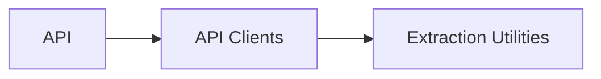

# Alert Term Extraction

<div id="top"></div>

A FastAPI app for extracting alert terms from unstructured alert texts. Designed for integration into larger systems or as a standalone tool for information extraction via a deployable microservice with Docker.

---

<details>
  <summary>📋 Table of Contents</summary>
  <ol>
    <li><a href="#-motivation">🧠 Motivation</a></li>
    <li><a href="#-solution-approach">🛠️ Solution Approach</a></li>
    <li>
      <a href="#-getting-started">🚀 Getting Started</a>
      <ul>
        <li><a href="#prerequisites">Prerequisites</a></li>
        <li><a href="#installation">Installation</a></li>
        <li><a href="#configuration">Configuration</a></li>
        <li><a href="#usage">Usage</a></li>
      </ul>
    </li>
    <li><a href="#-features">✨ Features</a></li>
    <li><a href="#️-architecture-overview">🏗️ Architecture Overview</a></li>
    <li><a href="#-api-documentation">📡 API Documentation</a></li>
    <li><a href="#-file-structure">📂 File Structure</a></li>
    <li><a href="#-license">📄 License</a></li>
    <li><a href="#-additional-notes">📝 Additional Notes</a></li>
    <li><a href="#-contact">👤 Contact</a></li>
    <li><a href="#-acknowledgments">🙏 Acknowledgments</a></li>
  </ol>
</details>

## 🧠 Motivation

Extracting keywords or any other terms of interest from any source of unstructured text is a common task in many domains, such as supply chain intelligence. It can be the first step in a complex data pipeline used to filter out relevant information that might be processed further in downstream processes. This project aims to provide a robust, extensible foundation for extracting terms from raw messages.

This project tackles a challenge proposed by [Prewave](https://www.prewave.com) as part of their hiring process.

<p align="right">(<a href="#top">back to top</a>)</p>

## 🛠️ Solution Approach

The underlying solution is simple: terms obtained from the alert terms API are directly matched against the alert text, in order or separately, depending on the `keepOrder` flag. The parameter `language` is optionally used as a filter to only match terms and texts in the same language. Both strings are previously lowercased. Matches are hashes to ensure that duplicate matches are not returned.

### Potential Improvements

1. **Latency**: For very large alert texts or term lists, performance may degrade. Potential improvements could include splitting the alert text into smaller chunks and processin them in parallel. In the tests carried out, most texts were very short, so this was not an issue.
2. **Matching Algorithm**: The current implementation uses a simple substring match. More complex matching (e.g., fuzzy matching, embedding-based search) could be implemented for better accuracy but may increase complexity and processing time. Naturally, this depends heavily on the use case requirements. For example, one might be interested in matching "IG Metall" to "IG Metal" or "IG-Metall": variants containing typos or different separators. The parameter `textType` might be used in the future to determine the matching strategy to use.
3. **Output**: The matching results are currently stored in a local .jsonl file for simplicity. In a production system, this could be replaced with a more robust, cloud-based storage solution (e.g., database, datalake) to handle larger volumes of data and provide better scalability. A message system could also be set up so other microservices can consume the results in real-time.

## 🚀 Getting Started

### Prerequisites

- **Python**: 3.12 or higher (see `pyproject.toml`)
- **uv**: For fast dependency management (optional, [Installation Guide](https://github.com/astral-sh/uv))
- **Docker**: For containerized deployment (optional)

### Installation

1. **Clone the repository**:

   ```fish
   git clone https://github.com/uziel/alert-term-extraction.git
   cd alert-term-extraction
   ```

2. **Install dependencies** (recommended: use `uv`):

   Install Python dependencies using `uv`:

   ```bash
   uv sync
   ```

   Install local package for development:

   ```bash
   uv pip install -e .
   ```

### Configuration

Configuration is managed via environment variables defined in a `.env` file at the root of the respository. Some of them are then loaded into a Pydantic Settings class for usage throughout the codebase.

Copy the example configuration file:

```fish
cp .env.dist .env
```

And edit `.env` with your settings.

### Usage

#### Starting the FastAPI App

Locally:

```fish
fastapi dev src/app/main.py --reload --port 8000
```

Or via Docker:

```fish
docker compose down && docker compose build && docker compose up -d
```

Operational logs as well as outputs will be available under `.logs/`.

<p align="right">(<a href="#top">back to top</a>)</p>

## ✨ Features

- Extracts key alert terms from alert text
- Modular extraction utilities for easy extension
- Configurable logging and settings
- Pydantic schemas for structured data handling
- Docker support for deployment
- Unit tests for core extraction logic

<p align="right">(<a href="#top">back to top</a>)</p>

## 🏗️ Architecture Overview

The project is organized as a Python package with a focus on modularity and testability.



1. **API**: Entry point for service (FastAPI app)
2. **API Clients**: Internal/external clients for interacting with the API
3. **Extraction Utilities**: Core logic for parsing and extracting terms

<p align="right">(<a href="#top">back to top</a>)</p>

## 📡 API Documentation

The Alert Term Extraction API exposes the following endpoints:

### `POST /start-extraction`

Start the alert term extraction process in a background worker.

**Request Body:**

```json
{
  "frequency_ms": 500, // integer (100-1000), frequency of checks in milliseconds
  "total_checks": 100 // optional integer, number of checks to perform (default: 100, null = infinite)
}
```

**Response:**

```json
{
  "message": "Extraction started with frequency 500ms and 100 checks",
  "process_id": 12345
}
```

**Errors:**

- 400: Extraction process is already running
- 500: Failed to start extraction

---

### `POST /stop-extraction`

Stop the currently running extraction process.

**Response:**

```json
{
  "message": "Extraction process stopped successfully"
}
```

**Errors:**

- 400: No extraction process is currently running
- 500: Failed to stop extraction

---

### `GET /extraction-status`

Get the current status of the extraction process.

**Response:**

```json
{
  "status": "running", // or "stopped"
  "process_id": 12345, // present if running
  "message": "Extraction is running"
}
```

---

### `GET /health`

Health check endpoint.

**Response:**

```json
{
  "status": "healthy",
  "timestamp": 1723550400.123
}
```

---

The extraction process fetches alerts and query terms from external APIs, matches terms to alert texts, and logs the results. For more details, see the extraction logic in `src/app/utils.py` and the data models in `src/models/`.

<p align="right">(<a href="#top">back to top</a>)</p>

## 📂 File Structure

```bash
alert-term-extraction/
├── README.md
├── pyproject.toml
├── uv.lock
├── docker-compose.yml
├── docker/
│   └── app/
│       └── Dockerfile
├── src/
│   ├── app/
│   ├── clients/
│   ├── config/
│   ├── extraction/
│   ├── models/
│   └── tests/
```

<p align="right">(<a href="#top">back to top</a>)</p>

## 📄 License

This project is licensed under the MIT License. See the [LICENSE](LICENSE) file for details.

## 📝 Additional Notes

- Code is formatted and linted using [Ruff](https://github.com/astral-sh/ruff).
- To ensure code quality, run:
  ```fish
  ruff check . --fix && ruff format . && ruff check --fix --select I
  ```
- If you use pre-commit hooks, add Ruff to your `.pre-commit-config.yaml`.

<p align="right">(<a href="#top">back to top</a>)</p>

## 👤 Contact

[](https://github.com/CarlosUziel)[](https://scholar.google.co.uk/citations?user=tEz_OeIAAAAJ&hl)[](https://www.linkedin.com/in/carlosuziel)[](https://perez-malla.com/)

<p align="right">(<a href="#top">back to top</a>)</p>

## 🙏 Acknowledgments

- **Prewave Data Science Team**: For the opportunity to tackle this challenge
- **Open Source Contributors**: For the tools and libraries that made this project possible

<p align="right">(<a href="#top">back to top</a>)</p>
